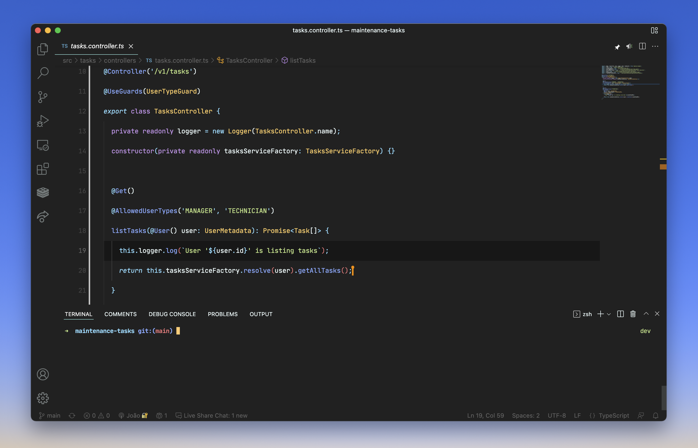
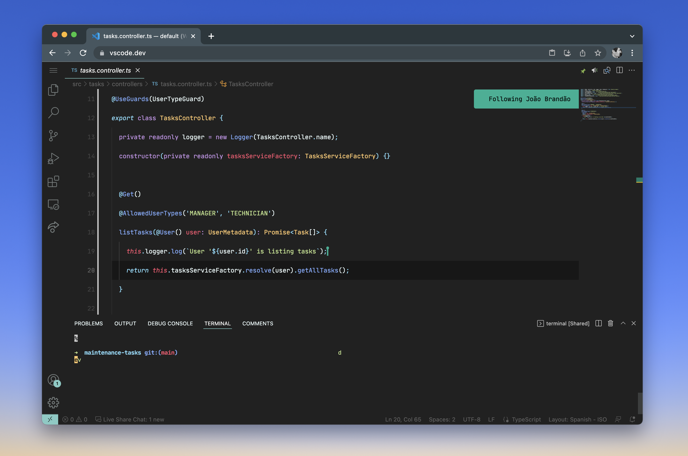

# Happy Teams with Coding Dojos

Building and powering up software development teams is not just about hiring good developers. It’s also about keeping them happy, challenged and engaged.

Over the past years, I’ve been pushing for the teams I work with to share the knowledge between their members. I’ve done it through *Knowledge Sharing Sessions*, *Hands-On Sessions* and more recently with *Coding Dojos*. All of these have had great advantages for teams but I noticed that *Coding Dojos* have not only a great technical and social impact but they’re also a great contribution to the team member's happiness.

Let’s see two of the *Coding Dojos* fundamental pieces and some tools to help with them.

> “A Coding Dojo is a meeting where a bunch of coders get together to work on a programming challenge.“ - codingdojo.org
> 

## Challenges

As per definition, the main goal is to tackle a programming challenge. **The challenge is what you want to solve.** There are so many different ones that, for me usually the most difficult part is choosing one.

Choosing a challenge always depends on what exactly you want to **technically tackle**. I tend to choose according to what I see and understand from the team’s daily work: difficulties, improvements or new topics to keep the learning going.

Here are a couple of topics that usually challenges want to tackle:

- SOLID principles
- Pair-programming
- Refactoring
- Test-Driven Development (TDD)
- ...

And here are a couple of *Web* sites to help you pick them up:

[LeetCode](https://leetcode.com/)

[Dojo Puzzles](https://dojopuzzles.com/)

[Kata-Log](https://kata-log.rocks/index.html)

## Constraints

As I said initially, *Coding Dojos* are not just about the technical impact but social as well. **Constraints are how you want the challenge to be solved.** I like to call this the fun part of Dojos. They are a set of rules that participants must follow so the result is valid.

Here are a couple of constraints that I usually choose for Dojos:

- 1 pilot (coding) + 1 co-pilot (helping) + rest in silence.
- No passing of primitives between methods as parameters or return types.
- Do not use “else”.
- No more than 2 parameters per method.

By adding constraints to the challenge we can:

- Enforce participants to choose specific technical topics to overcome the challenge.
- Enforce collaboration and communication between participants.

## Tools

Currently, more and more teams work in remote environments so we should use the right tools to help us out. I’ve been mostly using a combination of an IDE/Code Editor and whatever provider the team uses for calls. The goal here is to have everyone writing and reading code at the same time and in the same place while they’re able to speak to one another.

VS Code has been my number 1 choice for this. It allows multiple people to work on the code at the same time by using the Live Share extension with very decent performance! Plus different developers use different IDEs and code editors and VS Code can run in a *Web* browser just by going to vscode.dev. I mean, anyone can be up and running for the *Coding Dojo* in less than 5 minutes with pretty much everything they need.

> VS Code - Host

> VS Code - Participant in Browser

## Conclusion

I have been using *Coding Dojos* mainly for three reasons:

- technical skills improvement
- engaging the team to socialize and have fun together
- bring community trends and best practices in

We pick up a challenge which is about what we want to tackle on the technical side. The challenge we choose is usually related to topics we want the team to improve or learn based on topics like TDD, SOLID principles, refactoring techniques and many more!

Solving problems to technically improve people and teams is great. But there’s nothing like having fun doing it! To do that, we usually add constraints to the challenge to impact how people interact with each other.

So now go and try it yourself! If you do, let me know about the outcome. 👋