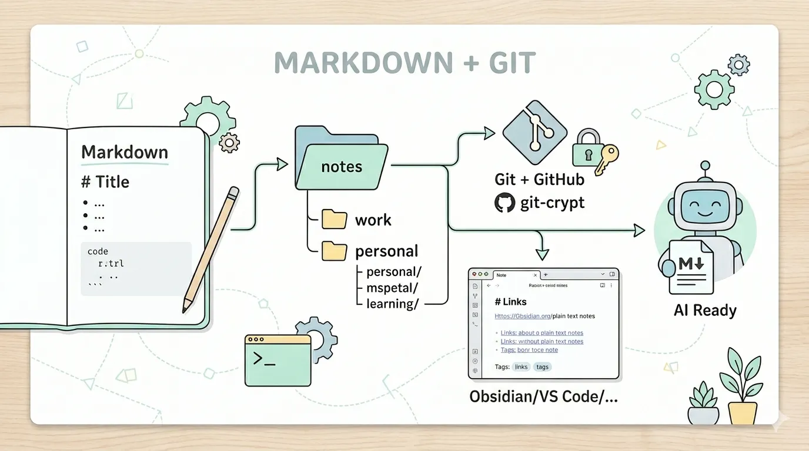

# Moved My Notes to Git, and I like it!



I moved most of my notes into Markdown files, versioned them with Git, encrypted the sensitive bits, and I’m enjoying it!

This post is about why I did it, what the system looks like, and exactly how you can replicate it.

## Why I moved to .md files

The honest reason isn’t that note apps own my data - technically, so does GitHub now.
I spend my **entire day writing code or Markdown** at work. Headers, bullet points, code blocks. That’s the syntax I reach for automatically. Using a note app means learning its shortcuts, its formatting rules, its way of doing things. That’s a context switch I don’t want to do.

The second reason is **portability**. A Markdown file isn’t tied to any tool. I can open it in Obsidian today, in VS Code tomorrow, or in my terminal with vim if I need to. The format outlives any app. That’s not true of most note-taking tools - something always gets lost in translation.

The third reason is **AI**. Markdown has quietly become the default input format for working with large language models (LLMs). When I want to use AI to work through a problem, I can point it at a folder of .md files with zero friction. No export, no copy-paste, no format conversion. Plain text is already the format AI tools expect and work well with.

I still use Apple Notes, but only for shared family notes, where the real-time collaboration genuinely wins. Everything else lives in the repository.

## What the System Looks Like

The stack is minimal on purpose:

- **Git + GitHub** - version control for your notes. Every commit is a save. You get full history, diffs, and a remote backup.
- **git-crypt** - transparent encryption for sensitive files. Remote repository encrypted, local machine decrypted.
- **Obsidian/VS Code** - a Markdown reader/editor that works directly on your files. No database, no sync layer, no lock-in. It’s just a good interface for files you already own.

That’s it. No proprietary sync. No subscriptions for features you don’t need. Your notes are just files.

## Folder Structure

The repository root folder and folder-based separation between personal and work. No special configuration required.

File and folder naming convention: **lowercase words separated by dashes**. No spaces. This matters more than it sounds — you’ll eventually `cd` into these folders or `grep` through them from the terminal, and spaces are a tax you don’t need to pay.

```text
notes/
├── work/
│   ├── projects/
│   ├── meetings/
│   └── team/
├── personal/
│   ├── goals/
│   ├── learning/
│   └── ideas/
└── .gitattributes
```

## How to Set It Up

### Prerequisites

- Git installed and configured
- A GitHub account (or any other provider!)
- Homebrew (macOS)
- Obsidian/VSCode/whatever app you want to use to read/write your notes installed

### Step 1 - Install git-crypt

```bash
brew install git-crypt
```

### Step 2 - Create your root folder and initialize git

```bash
mkdir notes
cd notes
git init
```

### Step 3 - Initialize git-crypt

```bash
git-crypt init
```

This generates a symmetric key that will be used to encrypt your files. The key lives at `.git/git-crypt/keys/default`. Back this up. More on that below.

### Step 4 - Configure what gets encrypted

Create a `.gitattributes` file at the root folder. This tells git-crypt which files to encrypt. You can be as granular as you want - encrypt everything, or just specific folders or files.

Encrypt everything in the `work/` folder and `personal/` folder:

```text
work/** filter=git-crypt diff=git-crypt
personal/** filter=git-crypt diff=git-crypt
```

Or encrypt only specific sensitive folders:

```text
work/projects/** filter=git-crypt diff=git-crypt
personal/goals/** filter=git-crypt diff=git-crypt
```

> ⚠️ Files not matched by `.gitattributes` are stored as plain text in the repo.

### Step 5 - Export and back up your key

Before you push anything, export your encryption key and store it somewhere safe:

```bash
git-crypt export-key ~/git-crypt-notes.key
```

> ⚠️ **Store this key in a safe place!** If you lose this key, your encrypted notes are unrecoverable. There is no “forgot my key” flow!

### Step 6 - Create your GitHub repository

Create a new **private** repository on GitHub. Then connect it:

```bash
git remote add origin git@github.com:your-username/notes.git
```

### Step 7 - First commit and push

```bash
echo "# notes" >> README.md
git add .
git commit -m "chore: init notes"
git push -u origin main
```

If you browse your encrypted folders on GitHub, you’ll see binary gibberish. That’s the point.

### Step 8 - Automate Backups

You’ll want a script that commits and pushes your changes automatically. I’ve created a `.scripts` folder to include some useful script that I need for my notes.
Run it via a cron job or a launchd agent on macOS. Every hour is usually enough. Whenever you finish a big writing session works too.

[Backup Script](https://gist.github.com/joaorbrandao/3656f28738d6cd8a362fb9ac86a9c30d)

### Step 9 - Restoring on a new machine

When you set up a new machine or clone the repo fresh:

```bash
git clone git@github.com:your-username/notes.git
cd notes
git-crypt unlock /path/to/git-crypt-notes.key
```

Your key file needs to be present (retrieved from your password manager). After `unlock`, all your encrypted files are readable again. Open in your editor and you’re back.

## Living With the System

A few things that make it actually work day-to-day:

**Write in Markdown from the start.** Don’t fight the format. Headers, bullet points, code blocks. You’re writing files, not filling forms.

**Commit often, not perfectly.** This isn’t a codebase. Commit messages like chore: backup are fine. The value is in the history, not the message.

**Use the terminal when it’s faster.** Your notes are just files. grep -r "kubernetes" work/ works. You’re not trapped in a search UI.

**Share folders selectively with AI tools.** When I want to use an AI agent to work through something, I give it access to the relevant folder. Plain text means zero friction. No export, no copy-paste, no format conversion.

## What You Give Up

This system isn’t for everyone. A few honest tradeoffs:

- **No mobile sync** (yet, for me). iOS doesn’t play nicely with git-crypt without some extra setup. I use Apple Notes for anything that needs to be mobile-first.
- **No real-time collaboration.** If you need multiple people editing notes simultaneously, this isn’t it.
- **Manual backup discipline.** The script helps, but you have to set it up. It won’t run itself until you make it run itself.
- **No fancy features.** No embedded databases, no kanban views, no AI writing assistants baked in. It’s files. That’s the feature.

## The Case For Plain Text

Your notes are one of the most personal, long-lived things you produce. You’ll want to read a note from five years ago. You’ll want to search across everything. You’ll want to move to a different editor someday without losing anything.
Plain Markdown files survive all of that. They’ll open in any editor, on any OS. They work with every developer tool you already know.

Is this for you? Only you know. At least, you know how to set it up now.

Enjoy!
